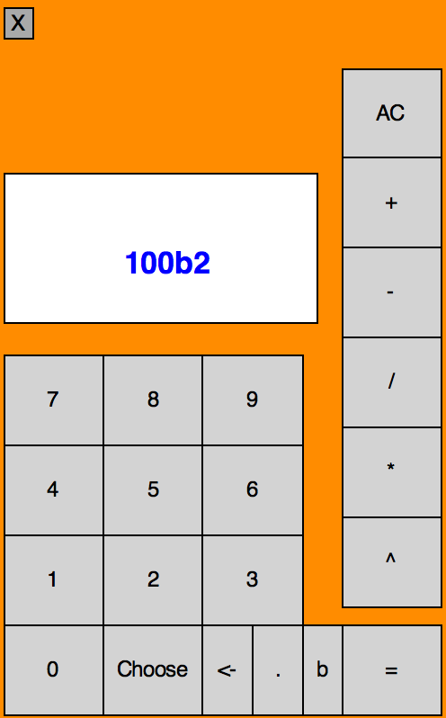

# Calculator GUI

Playing around with math, recursive functions, and a python graphics library. Don't try to do anything too crazy on this thing!

## How to run

> cd Python-Calculator-GUI  
> python3 calculatorFinal.py

## Features
1. Addition
2. Subtraction
3. Multiplication
4. Division
##### Recursive Implementations
5. Exponents
6. Combination (i.e. "10 choose 2" evaluates to 45)
7. Base Conversion

#### Here's what the GUI will look like for a conversion of 100 to base 2
</img>
